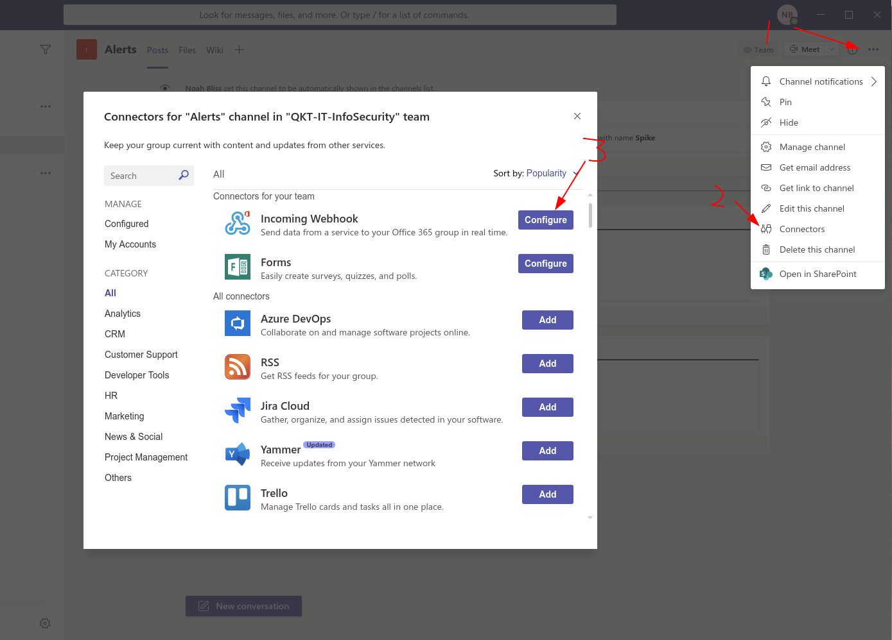
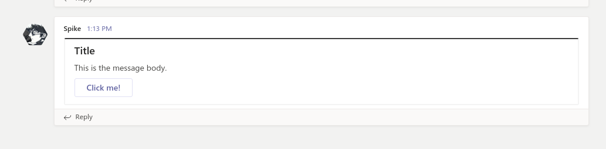

# O365 Teams Webhook Julia Implementation
Basic message sending using the Teams Webhook functionality implemented in Julia.

## Step 1: Make a webhook connector:
 

## Step 2: Get this software and install the packages you need.  

```
git clone https://github.com/noahbliss/TeamsWebhook-Julia.git
julia
]
add HTTP JSON DelimitedFiles
#backspace
#^D
```

## Step 3: Edit spike.conf with your webhook's URI
```
$EDITOR spike.conf
```

## Step 4: Edit `client.jl` with the message you want to send, then run the thing.
```
$EDITOR client.jl
julia client.jl
```


Final note, `client.jl` gives you shorter code and easier access to change the "card" but `client2.jl` is a bit more immediately usable in other projects and in my opinion, better written. Both should work.
